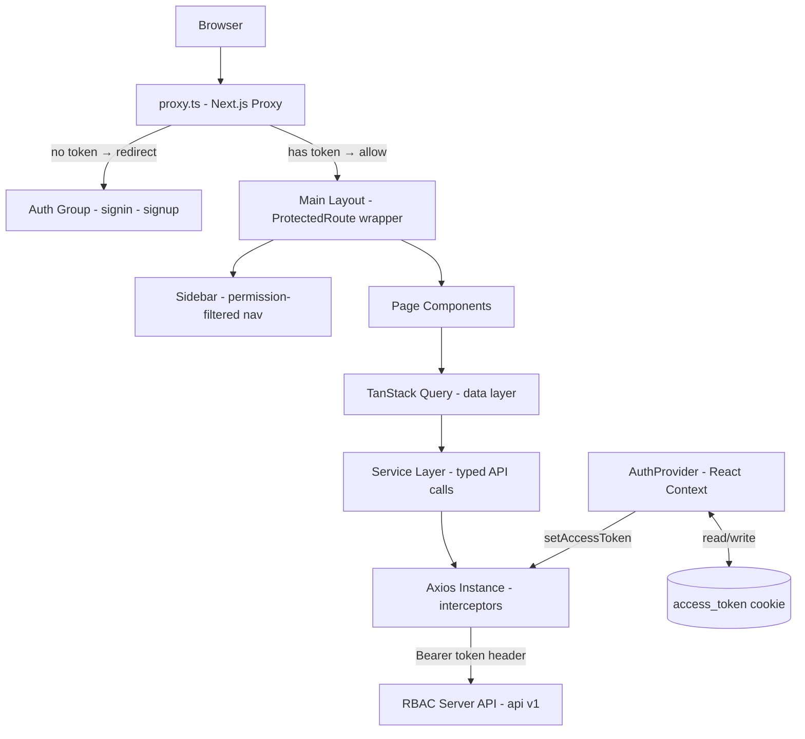
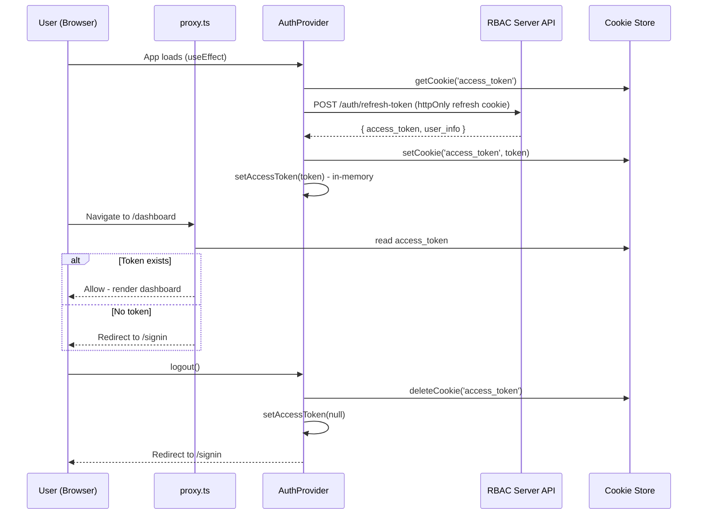
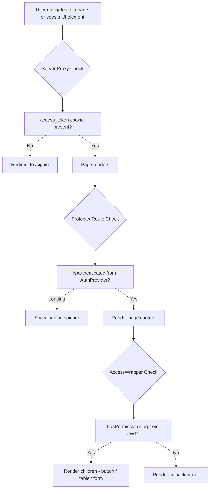

# RBAC Website

This is the frontend client for the Dynamic Permission-Based Role Access Control (RBAC) system. Built with Next.js App Router and Shadcn UI, it delivers a Glassmorphism-styled dashboard where every navigation item, button, and data table is assembled at runtime based on the authenticated user's resolved permission set. What a user sees is never hardcoded by role — it is dynamically composed from atomic permission slugs.

---

## Table of Contents

- [RBAC Website](#rbac-website)
  - [Table of Contents](#table-of-contents)
  - [Core Modules and Features](#core-modules-and-features)
    - [Authentication System](#authentication-system)
    - [Dynamic Permission UI](#dynamic-permission-ui)
    - [Dashboard Modules](#dashboard-modules)
    - [Data Management](#data-management)
  - [Tech Stack](#tech-stack)
  - [Architecture](#architecture)
    - [System Architecture Diagram](#system-architecture-diagram)
    - [Auth and Token Flow](#auth-and-token-flow)
    - [Permission Guard Flow](#permission-guard-flow)
  - [Project Directory Map](#project-directory-map)
  - [Page and Route Structure](#page-and-route-structure)
  - [Key Design Patterns](#key-design-patterns)
    - [Token Management](#token-management)
    - [API Client](#api-client)
    - [Permission Guards](#permission-guards)
    - [Server-Side Route Protection](#server-side-route-protection)
  - [Development and Deployment](#development-and-deployment)
    - [Development Setup](#development-setup)
    - [Environment Variables](#environment-variables)
    - [Production Build](#production-build)
    - [Vercel Deployment](#vercel-deployment)
  - [Production Readiness Checklist](#production-readiness-checklist)
  - [License](#license)

---

## Core Modules and Features

### Authentication System

- **Dual-Screen Auth Flow**: Dedicated `/signin` and `/signup` pages with Zod schema validation and `react-hook-form`.
- **Cookie-Based Token Storage**: The `access_token` is stored in a browser cookie via `cookies-next`, making it readable by both the client and the Next.js server proxy, enabling true server-side route protection.
- **Auto Token Refresh on Load**: On every app initialization, `AuthProvider` calls the refresh token endpoint. If valid, a fresh `access_token` is issued and stored. If it fails, any stale session data is cleared and the user is redirected to signin.
- **Graceful Session Cleanup**: Logout clears the cookie, `localStorage` user record, in-memory token state, and redirects to `/signin`.

### Dynamic Permission UI

- **Runtime Navigation Filtering**: The Sidebar renders navigation items conditionally based on `hasPermission()` checks from `useAuth()`, so each user only sees the pages they are allowed to access.
- **Component-Level Guards**: The `AccessWrapper` component wraps any UI element (button, table, form) and renders it only if the user holds the required permission slug, otherwise rendering a `fallback` or nothing.
- **Permission Manager**: A dedicated UI component allows admins and managers to assign permissions to users and roles with a grouped, module-based layout.

### Dashboard Modules

- **Dashboard**: Overview cards and summary metrics.
- **Users**: User listing with suspend, ban, restore, delete, and direct permission assignment capabilities.
- **Roles**: Role management with permission assignment via the Permission Manager component.
- **Permissions**: Grouped view of all available permission atoms organized by module.
- **Leads**: CRM lead records with full CRUD.
- **Tasks**: Task assignment and status tracking.
- **Reports**: Report listing and storage access.
- **Audit Logs**: Full system audit trail and personal activity log.
- **Customer Portal**: Self-service portal for customers.
- **Settings**: Account and system settings.

### Data Management

- **TanStack Table**: Server-side pagination, column sorting, and search filtering across all data tables.
- **TanStack Query**: Data fetching, caching, background refetching, and mutation handling.
- **Standardized Service Layer**: All API calls are routed through typed service files (`userService`, `roleService`, etc.) that use a generic `IResponse<T>` interface for consistent response handling.

---

## Tech Stack

| Category             | Technology                                 |
| :------------------- | :----------------------------------------- |
| Framework            | Next.js 16 (App Router, Turbopack)         |
| Language             | TypeScript (v5.x)                          |
| UI Component Library | Shadcn UI (Radix UI primitives)            |
| Styling              | Tailwind CSS v4                            |
| Data Fetching        | TanStack Query v5                          |
| Data Tables          | TanStack Table v8                          |
| Form Handling        | React Hook Form + Zod                      |
| HTTP Client          | Axios (with request/response interceptors) |
| Cookie Management    | cookies-next                               |
| Toast Notifications  | Sonner                                     |
| Theme Management     | next-themes (dark/light mode)              |
| Icons                | Lucide React                               |

---

## Architecture

### System Architecture Diagram

<div align="center">



</div>

### Auth and Token Flow

<div align="center">



</div>

### Permission Guard Flow

<div align="center">



</div>

---

## Project Directory Map

```text
src/
├── app/
│   ├── (auth)/                       # Auth route group - no sidebar layout
│   │   ├── signin/
│   │   │   └── page.tsx              # Login page
│   │   └── signup/
│   │       └── page.tsx              # Registration page
│   ├── (main)/                       # Main dashboard route group
│   │   ├── layout.tsx                # Sidebar + Header + ProtectedRoute wrapper
│   │   ├── dashboard/page.tsx
│   │   ├── users/page.tsx
│   │   ├── roles/page.tsx
│   │   ├── permissions/page.tsx
│   │   ├── audit-logs/page.tsx
│   │   ├── leads/page.tsx
│   │   ├── tasks/page.tsx
│   │   ├── reports/page.tsx
│   │   ├── customer-portal/page.tsx
│   │   └── settings/page.tsx
│   ├── globals.css                   # Glassmorphism design tokens and CSS variables
│   └── layout.tsx                    # Root layout with providers
├── components/
│   ├── auth/
│   │   ├── signin-form.tsx           # Login form with Zod validation
│   │   ├── signup-form.tsx           # Registration form with Zod validation
│   │   └── protected-route.tsx       # Client-side auth guard wrapper
│   ├── dashboard/
│   │   └── permission-manager.tsx    # UI for assigning permissions to roles/users
│   ├── layout/
│   │   ├── sidebar.tsx               # Permission-filtered navigation sidebar
│   │   └── header.tsx                # Top header with user menu and theme toggle
│   └── ui/                           # Shadcn component library (Button, Card, DataTable, etc.)
├── config/
│   └── env.ts                        # Zod-validated environment variables
├── hooks/
│   └── use-mobile.tsx                # Responsive breakpoint hook
├── lib/
│   └── api.ts                        # Axios instance with auth interceptors
├── middlewares/                       # Additional client-side middleware utilities
├── providers/
│   ├── auth-provider.tsx             # Global auth state, login, logout, hasPermission
│   ├── contex-provider.tsx           # TanStack Query client provider
│   └── theme-provider.tsx            # next-themes dark/light mode provider
├── services/
│   ├── auth.service.ts               # signin, signup, refresh, change/forget password
│   ├── user.service.ts               # getAll, getById, update, suspend, ban, assignPermissions
│   ├── role.service.ts               # getAll, create, update, delete, assignPermissions
│   ├── permission.service.ts         # getAll, getGrouped
│   ├── audit-log.service.ts          # getAll, getMyLogs
│   ├── lead.service.ts               # CRUD operations for leads
│   ├── task.service.ts               # CRUD operations for tasks
│   └── report.service.ts             # CRUD operations for reports
├── types/
│   ├── user.type.ts                  # IUser, IAuthUser interfaces
│   ├── role.type.ts                  # IRole interface
│   ├── auth.type.ts                  # ILoginResponse, IRefreshTokenResponse
│   ├── lead.type.ts                  # ILead interface
│   ├── task.type.ts                  # ITask interface
│   ├── report.type.ts                # IReport interface
│   └── audit-log.type.ts             # IAuditLog interface
├── wrappers/
│   └── access-wrapper.tsx            # Component-level permission guard
└── proxy.ts                          # Next.js server-side proxy for route protection
```

---

## Page and Route Structure

| Route              | Group    | Permission Required | Description                          |
| :----------------- | :------- | :------------------ | :----------------------------------- |
| `/signin`          | `(auth)` | Public              | Login page                           |
| `/signup`          | `(auth)` | Public              | Registration page                    |
| `/dashboard`       | `(main)` | Authenticated       | Overview and summary metrics         |
| `/users`           | `(main)` | `manage_users`      | User management and status control   |
| `/roles`           | `(main)` | `manage_roles`      | Role CRUD and permission assignment  |
| `/permissions`     | `(main)` | `manage_roles`      | Grouped permission atom viewer       |
| `/audit-logs`      | `(main)` | `view_audit_logs`   | System-wide and personal audit trail |
| `/leads`           | `(main)` | `view_leads`        | CRM lead records                     |
| `/tasks`           | `(main)` | `view_tasks`        | Task management and assignment       |
| `/reports`         | `(main)` | `view_reports`      | Business report storage and viewer   |
| `/customer-portal` | `(main)` | Authenticated       | Self-service customer portal         |
| `/settings`        | `(main)` | Authenticated       | Account and system settings          |

---

## Key Design Patterns

### Token Management

The application uses a two-layer token strategy:

- **In-Memory (`access_token` variable in `api.ts`)**: Used on every Axios request via the `Authorization` header. This is set by `setAccessToken()` and cleared on logout. It survives only for the current session tab and is never written to disk, reducing XSS exposure.
- **Cookie (`access_token` via `cookies-next`)**: Written on login and refresh. This enables the `proxy.ts` server-side middleware to read the token on every navigation request and redirect unauthenticated users before any React code runs. Cleared on logout via `deleteCookie()`.

### API Client

The Axios instance in `src/lib/api.ts` handles all HTTP communication:

- **Base URL**: Injected from the validated `NEXT_PUBLIC_API_URL` environment variable.
- **Request Interceptor**: Automatically attaches the in-memory `access_token` as a `Bearer` token on every outgoing request.
- **Response Interceptor**: Unwraps `response.data` so service functions always receive the parsed API response directly.

### Permission Guards

Two layers of client-side permission enforcement are used alongside the server proxy:

- **`ProtectedRoute`** (in `(main)/layout.tsx`): Checks `isAuthenticated` from `AuthProvider`. If the user is not logged in (and the token refresh has failed), it redirects to `/signin`. Displays a loading state during the initial refresh check.
- **`AccessWrapper`** (component-level): A React component that accepts a `permission` string and an optional `fallback`. It calls `hasPermission()` from `useAuth()` and conditionally renders `children` or `fallback`. Used to hide or disable buttons, tables, and forms for users who lack a specific permission.

### Server-Side Route Protection

`proxy.ts` runs on the Next.js server edge before any page renders:

- All `(main)` routes are checked for the presence of the `access_token` cookie.
- If the cookie is absent, the request is immediately redirected to `/signin` server-side, preventing any flash of unauthenticated content.
- If the cookie is present on `/signin` or `/signup`, the user is redirected to `/dashboard` to prevent re-authentication.

---

## Development and Deployment

### Development Setup

1. **Install dependencies**:

   ```bash
   pnpm install
   ```

2. **Configure environment variables**:

   ```bash
   cp .env.example .env.local
   ```

   Fill in the required values in `.env.local`.

3. **Start the development server**:

   ```bash
   pnpm dev
   ```

   The application will be available at `http://localhost:3000`.

### Environment Variables

| Variable              | Description                      | Example                        |
| :-------------------- | :------------------------------- | :----------------------------- |
| `NEXT_PUBLIC_API_URL` | Base URL of the RBAC backend API | `http://localhost:5000/api/v1` |

### Production Build

1. **Build the application**:

   ```bash
   pnpm build
   ```

2. **Start the production server**:

   ```bash
   pnpm start
   ```

### Vercel Deployment

The `vercel.json` is configured for seamless Vercel deployment:

```json
{
  "version": 2,
  "buildCommand": "pnpm build",
  "installCommand": "pnpm install",
  "ignoreCommand": "git diff --quiet HEAD^ HEAD ./"
}
```

- Vercel automatically detects Next.js and handles the build output correctly.
- The `ignoreCommand` prevents unnecessary re-deploys when only the backend (`rbac-server`) code changes in the monorepo.
- Set `NEXT_PUBLIC_API_URL` in the Vercel project's environment variables pointing to the live backend URL.

---

## Production Readiness Checklist

- [x] **Type Safety**: Full TypeScript coverage with zero build errors.
- [x] **Server-Side Route Protection**: Cookie-based proxy guard prevents unauthenticated page flash.
- [x] **Client-Side Auth Guard**: `ProtectedRoute` handles session expiry and loading states.
- [x] **Component-Level Permission Guard**: `AccessWrapper` conditionally renders UI by permission slug.
- [x] **Token Auto-Refresh**: Refresh token flow runs on every app initialization for seamless sessions.
- [x] **Secure Token Storage**: Access token is in-memory and cookie; never in `localStorage`.
- [x] **Dynamic Navigation**: Sidebar items are filtered at runtime by user permissions.
- [x] **Optional Chaining Safety**: All API response accessors use optional chaining to prevent runtime crashes on undefined data.
- [x] **Lint Clean**: Zero ESLint errors (one known warning from TanStack Table's React Compiler memoization incompatibility — does not affect functionality).
- [x] **Vercel Ready**: `vercel.json` configured with correct build commands and ignore logic.

---

## License

Proprietary and Confidential. Unauthorized duplication or distribution is strictly prohibited.
